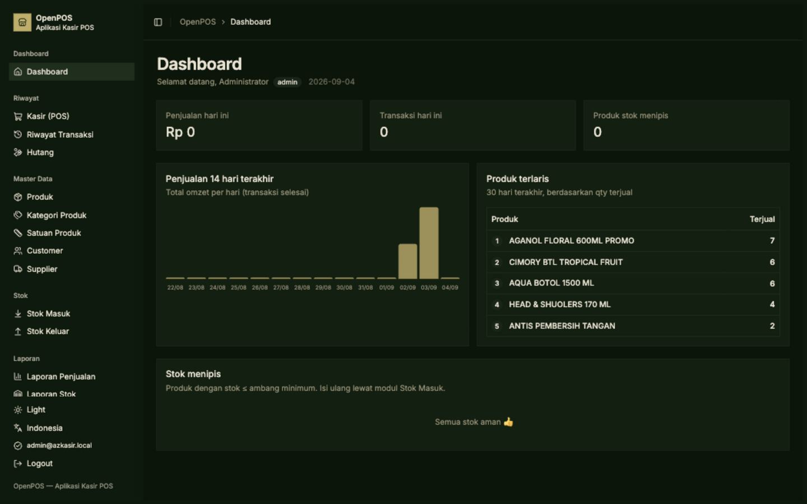
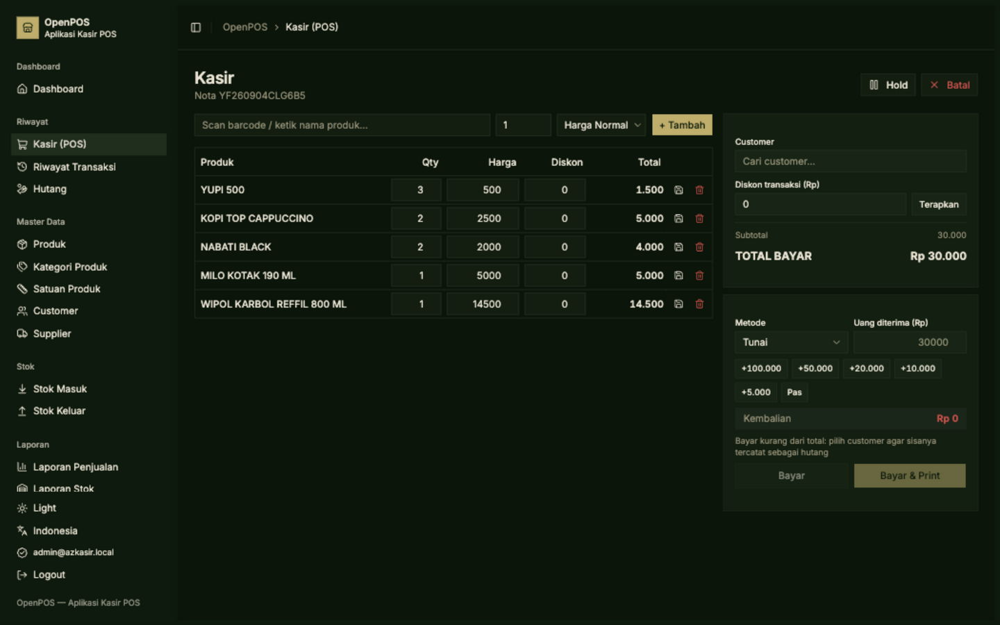
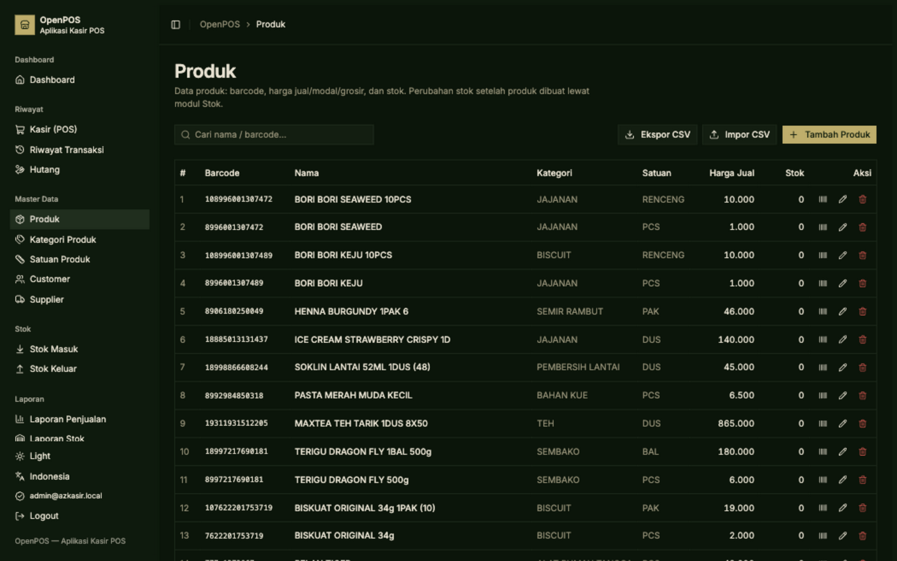
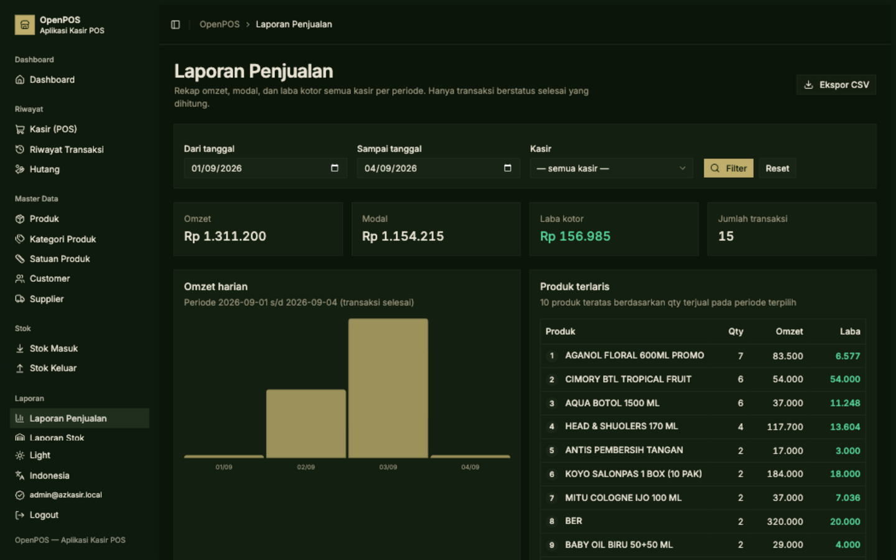
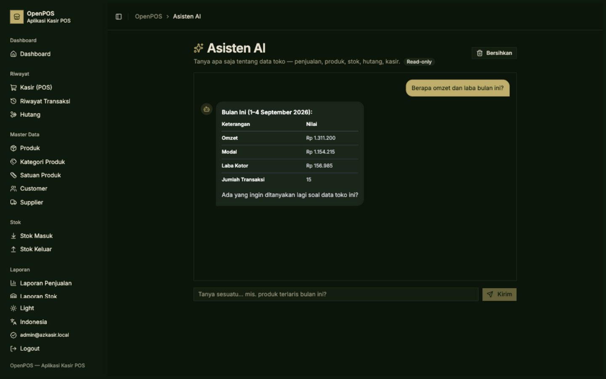
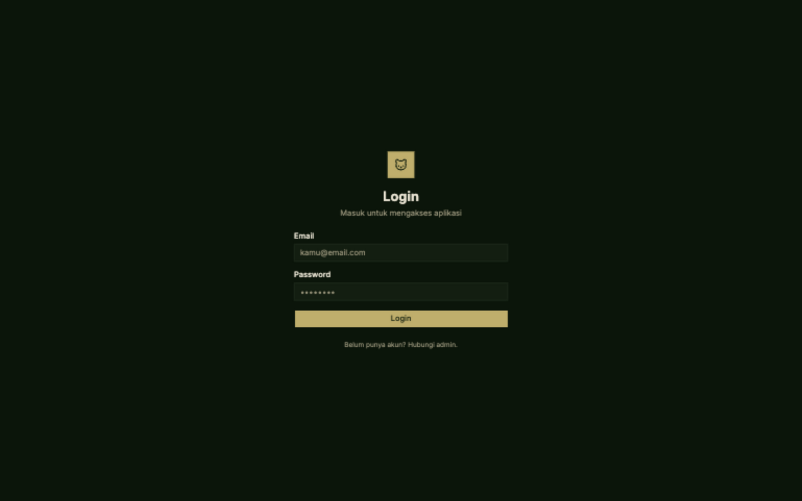

# OpenPOS

A free & open-source, web-based Point of Sale (POS) application for small-to-medium retail stores. Built with **SvelteKit (Svelte 5 runes) + TypeScript** on the app server and **PocketBase** (auth + SQLite + file storage) as the backend — designed to run on a single mini PC in the store or a cheap VPS.

> [!NOTE]
> The AI assistant and all money/profit calculations are **read-only**: the assistant can never modify your data, and profit figures use the *cost price snapshot* taken at sale time, so later cost edits never distort historical reports.

## Screenshots

| | |
|---|---|
|  |  |
| **Dashboard** | **Cashier (POS)** |
|  |  |
| **Products** | **Sales report** |
|  |  |
| **AI assistant (read-only)** | **Login** |

## Features

**Cashier (POS)**
- Barcode scanner support (keyboard-wedge) + product search autocomplete
- Cart with editable qty / price / per-item discount, wholesale price mode, per-customer special prices
- Hold / resume multiple carts (persisted server-side)
- Payments: cash, QRIS, debit, e-wallet; transaction-level discount; cash change calculator
- Debts: underpaid cash sales become customer receivables, with partial settlements
- Thermal receipt printing (58 mm / 80 mm) with configurable store address & footer, plus receipt reprint
- Keyboard shortcuts (F2 search, F4 payment)

**Inventory**
- Stock in / stock out with suppliers and reasons
- Full stock card (ledger) — every sale, void, restock and adjustment is recorded
- Low-stock warnings on dashboard & product list

**Master data**
- Products: barcode, cost/sell/wholesale prices, categories, units, photos
- CSV import & export, printable barcode labels (40×30 mm sheets)
- Customers (+ per-customer product prices) and suppliers

**Reports & insights**
- Sales report: revenue, cost, gross profit, daily chart, payment-method breakdown, best sellers, CSV export
- Stock movement report with date / type / product filters
- Audit log viewer (who changed what, old → new values)
- AI assistant (admin-only): ask questions in natural language — *"best sellers this month?"*, *"how much profit this year?"*, *"which customers still owe us?"* — answered from live data via read-only tool-calling

**Platform**
- Role-based access: admin (everything) & cashier (own transactions)
- Dark mode, English / Bahasa Indonesia (full UI i18n)
- Soft-delete + audit trail on critical mutations

## Tech stack

| Layer | Choice |
|---|---|
| Framework | SvelteKit + Svelte 5 (runes) + TypeScript, run with Bun |
| Styling | Tailwind CSS v4 + shadcn-svelte (bits-ui), dark mode |
| Backend | PocketBase (auth, SQLite, file storage, API rules) |
| i18n | Paraglide JS (inlang) — `id` & `en` |
| Receipt | Print CSS (thermal 58/80 mm), no special drivers |
| AI assistant | Any OpenAI-compatible chat-completions API with tool-calling |
| Barcode | JsBarcode (client-side SVG) |

## Getting started

### 1. Requirements

- [Bun](https://bun.sh) v1.x
- [PocketBase](https://pocketbase.io) binary
- Optional: an API key from any OpenAI-compatible provider (for the AI assistant)

### 2. Run PocketBase

```bash
./pocketbase serve --http=127.0.0.1:8094 --dir=pb_data --hooksDir=pb_hooks --automigrate=false
# in another terminal, create a superuser:
./pocketbase superuser upsert admin@example.com yourpassword
```

> `--automigrate=false` is required: the schema is managed by the idempotent `bun run setup:db` script, not by migration files.
> `--hooksDir=pb_hooks` is required: the transaction/sales summary pages call the aggregate endpoint defined in `pb_hooks/tx-stats.pb.js` (a few ms per query instead of fetching every transaction of the period).

### 3. Configure & seed

```bash
bun install
cp .env.example .env   # then fill PB_SUPERUSER_EMAIL / PB_SUPERUSER_PASSWORD
bun run setup:db       # idempotent: creates collections, API rules, seeds first admin
```

### 4. Run

```bash
bun run dev            # http://127.0.0.1:8791
```

First login: `admin@openpos.local` / `openpos123` — **change it immediately** in *Users*.

### 5. Enable the AI assistant (optional)

Add to `.env`:

```env
OPENAI_BASE_URL=https://api.openai.com/v1   # any OpenAI-compatible endpoint
OPENAI_API_KEY=sk-...
OPENAI_MODEL=gpt-4o-mini                    # must support tool-calling
```

The assistant answers only store-related questions, is restricted to **read-only** queries (no write tool exists, PocketBase API rules still apply, and it refuses write requests), and is visible only to admins.

## Environment variables

| Variable | Required | Description |
|---|---|---|
| `POCKETBASE_URL` | yes | PocketBase API URL (default `http://127.0.0.1:8094`) |
| `PB_SUPERUSER_EMAIL` / `PB_SUPERUSER_PASSWORD` | yes | Superuser credentials used by the server for atomic writes & setup |
| `SEED_ADMIN_EMAIL` / `SEED_ADMIN_PASSWORD` | no | First admin account created by `setup:db` (defaults `admin@openpos.local` / `openpos123`) |
| `OPENAI_BASE_URL` | no | OpenAI-compatible API base URL for the AI assistant |
| `OPENAI_API_KEY` | no | API key (kept server-side, never sent to the browser) |
| `OPENAI_MODEL` | no | Model with tool-calling support (default `gpt-4o-mini`) |

## Scripts

| Command | Description |
|---|---|
| `bun run dev` | Dev server (http://127.0.0.1:8791) |
| `bun run build` | Production build (adapter-node) |
| `bun run preview` | Preview the production build |
| `bun run check` | Type-check with svelte-check |
| `bun run setup:db` | Create PocketBase collections + rules + seed admin (idempotent) |

## Project structure

```
src/
├─ hooks.server.ts                 # auth guard + paraglide i18n middleware
├─ lib/
│  ├─ server/
│  │  ├─ ai.ts                     # AI assistant: read-only tools + LLM tool-calling loop
│  │  ├─ auth.ts / guard.ts        # session auth, requireUser / requireAdmin
│  │  ├─ pb.ts / crud.ts           # PocketBase clients, generic list/CRUD helpers
│  │  ├─ pos.ts                    # cart → atomic checkout (tx + items + stock movements)
│  │  ├─ stock.ts / products.ts    # stock ledger, product services
│  │  ├─ transaction.ts            # tx filters, period summary, void
│  │  ├─ csv.ts                    # minimal CSV parse/build
│  │  └─ audit.ts / settings.ts    # audit log helper, key-value settings
│  └─ components/                  # sidebar shell, charts, shared UI
└─ routes/
   ├─ /app                         # dashboard
   ├─ /app/pos (+ /receipt/[id])   # cashier + thermal receipt
   ├─ /app/products (+ /labels, /export)  # products, barcode labels, CSV export
   ├─ /app/stock/in | /stock/out   # stock in / out
   ├─ /app/transactions, /debts    # history, receivables
   ├─ /app/reports/sales | /stock  # reports
   ├─ /app/ai-chat (+ /send)       # AI assistant (admin)
   └─ /app/users | /settings | /audit  # admin
scripts/setup-pocketbase.ts        # collections + rules + seed (idempotent)
```

## Deployment

### Docker Compose (quick way)

```bash
cp .env.example .env   # set a strong PB_SUPERUSER password
docker compose up -d --build
# app : http://localhost:3000
# PB  : http://127.0.0.1:8094 (internal)

# first-time schema setup:
docker compose exec app sh -c "bun run setup:db"
```

### Manual (mini PC / VPS)

1. Install Bun/Node + the PocketBase binary.
2. Run PocketBase: `./pocketbase serve --http=127.0.0.1:8094 --dir=pb_data --automigrate=false`
   - Do **not** copy a dev `pb_migrations` folder to a fresh server — its collectionIds reference the dev database and will break startup.
3. `bun install && bun run build` → run `node build` (PORT=3000) behind a reverse proxy (Caddy/Nginx).
4. Production `.env`: `POCKETBASE_URL`, `PB_SUPERUSER_*` (strong passwords), `SEED_ADMIN_*`.
5. Backups: schedule a daily copy of `pb_data/data.db`.

## Notes

- **Money** is stored as integer rupiah (IDR has no practical cents).
- **Stock integrity** is maintained in the application layer — every stock change is a `stock_movements` ledger entry executed atomically at checkout; no DB triggers.
- The repository intentionally does **not** include the legacy-data import script used for this store's own migration.

## License

Released under the [MIT License](LICENSE).
